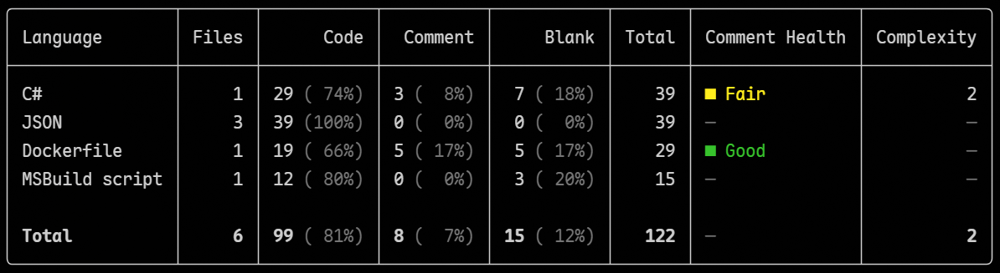
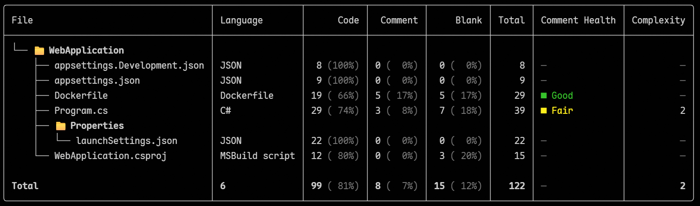

<a id="english"></a>
# Sloc

[English](#english) | [中文](#中文)

[](https://github.com/coldhighsun/Sloc/actions/workflows/ci.yml)
[](https://www.nuget.org/packages/Sloc)
[](https://www.nuget.org/packages/Sloc)
[](https://github.com/coldhighsun/Sloc/releases)
[](LICENSE)

Sloc (**S**ource **L**ines **O**f **C**ode) is a .NET global command-line tool for counting lines of source code. It analyzes files individually, distinguishing **code lines**, **comment lines**, and **blank lines**, then aggregates results by programming language. It supports 37 auto-detected languages, three output formats (table, JSON, HTML), per-file detail view, and comment health indicators.

## Features

- Count code / comment / blank / total lines
- Correctly handles single-line comments, block comments, and multi-line block comments
- Built-in comment rules for 37 common languages (auto-detected by file extension or name, e.g. `Makefile`, `Dockerfile`, `CMakeLists.txt`)
- Recursive directory scanning with `--include` / `--exclude` glob filters
- Automatically excludes `bin`, `obj`, `artifacts`, `.git`, `.vs`, `.vscode`, `.idea`, `node_modules`, and similar directories by default
- Three output formats: colored table (default), JSON, and HTML
- Comment Health column in table output showing comment-density indicator (None / Low / Fair / Good / High / Dense)
- Format auto-detected from the `--output` file extension (`.json` → JSON, `.html` / `.htm` → HTML)
- Honors `.gitignore` files (including nested ones) by default; `--no-gitignore` disables it
- Parallel analysis across CPU cores (`--jobs`), with deterministic output
- CI-friendly: JSON to stdout for piping (e.g. `| jq`), meaningful exit codes, and a `--min-comment-pct` threshold gate
- Compare against a saved JSON report with `--baseline` to see how line counts changed
- Sort and limit the language summary with `--sort` / `--top`
- Files or directories that cannot be read, and binary files (detected by NUL bytes), are skipped gracefully; a summary of skipped paths and reasons is shown at the end

## Installation

Install via [winget](https://learn.microsoft.com/windows/package-manager/winget/) (Windows):

```bash
winget install coldhighsun.sloc
```

Or install as a .NET global tool (requires .NET 8 SDK):

```bash
dotnet tool install --global Sloc
```

Update or uninstall:

```bash
winget upgrade coldhighsun.sloc
winget uninstall coldhighsun.sloc

dotnet tool update --global Sloc
dotnet tool uninstall --global Sloc
```

## Usage

```bash
sloc <path> [options]
```

### Examples

```bash
# Count current directory (recursive)
sloc

# Count a specific directory
sloc ./src

# Count a single file
sloc ./src/Program.cs

# Only count C# files
sloc ./src --include "**/*.cs"

# Exclude test directories
sloc . --exclude "**/tests/**"

# Show per-file details
sloc ./src --by-file

# Output as JSON
sloc ./src --format json

# Save results as HTML report (opens in a browser)
sloc ./src --format html --output report.html

# Auto-detect format from file extension
sloc ./src --output sloc-report.json

# Include files with unknown extensions
sloc . --all

# Do not recurse into subdirectories
sloc ./src --no-recursive

# Pipe JSON to jq
sloc . --format json | jq .total

# Fail CI if comments are below 10% of lines
sloc . --min-comment-pct 10

# Save a baseline, then diff a later run against it
sloc . --format json --output baseline.json
sloc . --baseline baseline.json

# Sort by comment lines and show only the top 5 languages
sloc . --sort comment --top 5
```

### Options

| Option | Short | Description |
| --- | --- | --- |
| `path` (argument) | | File or directory to analyze, defaults to current directory `.` |
| `--include` | `-i` | File glob pattern to include, can be specified multiple times |
| `--exclude` | `-e` | File glob pattern to exclude, can be specified multiple times |
| `--format` | `-f` | Output format: `Table` (default), `Json`, or `Html` |
| `--output` | `-o` | Output file path for `Json` / `Html` formats; use `-` to write to stdout; format is inferred from the file extension when `--format` is not specified |
| `--no-recursive` | | Do not recurse into subdirectories |
| `--no-health` | | Hide the Comment Health column and percentage breakdowns |
| `--by-file` | | Show per-file details in addition to the language summary |
| `--detailed` | | In `Json` / `Html` output, include both the language summary and the per-file breakdown |
| `--paged` | `-p` | Show paged output |
| `--all` | | Include files with unknown extensions (grouped as `Other`) |
| `--quiet` | `-q` | Suppress the banner, progress UI, and `Saved to` message |
| `--no-progress` | | Suppress the live table and progress bar |
| `--min-comment-pct` | | Fail (exit code `2`) if the overall comment percentage is below this value |
| `--jobs` | `-j` | Max files to analyze in parallel (default: processor count; `1` = sequential) |
| `--no-gitignore` | | Do not honor `.gitignore` files (they are respected by default) |
| `--baseline` | | Compare against a previously saved JSON report and show the line-count diff |
| `--sort` | | Order the language summary by `Total` (default), `Code`, `Comment`, `Blank`, `Files`, or `Name` |
| `--top` | | Show only the top N languages in the summary |
| `--no-update-check` | | Do not check GitHub for a newer release (checked by default, with a 2 second timeout) |
| `--help` | `-h` | Show help |
| `--version` | | Show version |

`Json` output is written to stdout by default (so it can be piped, e.g. `sloc . -f json | jq`); pass `--output` to write a file instead.

`.gitignore` files (including nested ones) are honored by default; pass `--no-gitignore` to disable. Save a JSON report and pass it to `--baseline` on a later run to see how line counts changed.

### Exit Codes

| Code | Meaning |
| --- | --- |
| `0` | Success |
| `1` | Path not found or unreadable |
| `2` | A threshold (e.g. `--min-comment-pct`) was not met |
| `3` | Unexpected error |

### Sample Output



With `--by-file` (tree view per file):



## Supported Languages

C#, C/C++, Java, Kotlin, Swift, JavaScript, TypeScript, Python, Go, Rust, PHP, Ruby, F#, Visual Basic, SQL, PowerShell, Shell, YAML, JSON, HTML, XML, CSS, SCSS/Less, Dart, Scala, R, Lua, Perl, Elixir, Haskell, Objective-C, TOML, Markdown, Terraform, Makefile, Dockerfile, CMake.

Files without an extension (e.g. `Makefile`, `Dockerfile`, `CMakeLists.txt`, `Rakefile`, `Gemfile`) are recognized by name.

> Files with unknown extensions are grouped as `Other` when using `--all`, with only code lines and blank lines distinguished.

## Building from Source

```bash
# Restore and build
dotnet build

# Run tests
dotnet test

# Pack as a NuGet tool package (output to ./nupkg)
dotnet pack src/Sloc.Cli/Sloc.Cli.csproj -c Release -o ./nupkg

# Install from local package and verify
dotnet tool install --global --add-source ./nupkg Sloc
sloc ./src
```

## Known Limitations

- Line classification is based on text matching of comment symbols, not a full lexer.
- String literals are recognized for most languages, so comment markers inside strings (e.g. `"// not a comment"`) are counted as code, and escaped quotes are handled. Verbatim/doubled-quote escaping (e.g. C# `@"…""…"`) is not modeled, and interpolation expressions inside strings are not analyzed.
- Python triple-quoted strings are counted as comments only when they begin a statement (docstrings); used as a value (e.g. `x = """…"""`) they are counted as code.

## License

This project is released under the [MIT License](https://opensource.org/licenses/MIT).

---

<a id="中文"></a>
# Sloc

[English](#english) | [中文](#中文)

[](https://github.com/coldhighsun/Sloc/actions/workflows/ci.yml)
[](https://www.nuget.org/packages/Sloc)
[](https://www.nuget.org/packages/Sloc)
[](https://github.com/coldhighsun/Sloc/releases)
[](LICENSE)

Sloc（**S**ource **L**ines **O**f **C**ode）是一个用于统计源代码行数的 .NET 全局命令行工具。它会逐文件分析代码，区分**代码行**、**注释行**和**空行**，并按编程语言进行聚合汇总，支持 37 种语言自动识别、三种输出格式（表格、JSON、HTML）、逐文件明细视图以及注释健康度指标。

## 功能特性

- 统计代码行 / 注释行 / 空行 / 总行数
- 正确处理单行注释、块注释以及跨多行的块注释
- 内置 37 种常见语言的注释规则（按文件扩展名或文件名自动识别，如 `Makefile`、`Dockerfile`、`CMakeLists.txt`）
- 递归扫描目录，支持 `--include` / `--exclude` glob 过滤
- 默认排除 `bin`、`obj`、`artifacts`、`.git`、`.vs`、`.vscode`、`.idea`、`node_modules` 等目录
- 三种输出格式：彩色表格（默认）、JSON 与 HTML
- 表格输出新增注释健康度列，显示注释密度指标（无 / 低 / 一般 / 良好 / 较高 / 过密）
- 未指定 `--format` 时，可根据 `--output` 文件扩展名自动推断格式（`.json` → JSON，`.html` / `.htm` → HTML）
- 默认遵循 `.gitignore` 文件（含子目录中的）；`--no-gitignore` 可禁用
- 跨 CPU 核心并行分析（`--jobs`），输出保持确定性
- 适配 CI：JSON 可输出到标准输出便于管道处理（例如 `| jq`）、提供有意义的退出码、以及 `--min-comment-pct` 阈值门禁
- 通过 `--baseline` 与已保存的 JSON 报告对比，查看行数变化
- 通过 `--sort` / `--top` 对语言汇总排序和限制条数
- 无法读取的文件或目录，以及二进制文件（通过 NUL 字节检测），会被自动跳过，并在最终结果中列出所有跳过的路径及原因

## 安装

通过 [winget](https://learn.microsoft.com/windows/package-manager/winget/) 安装（Windows）：

```bash
winget install coldhighsun.sloc
```

或作为 .NET 全局工具安装（需要 .NET 8 SDK）：

```bash
dotnet tool install --global Sloc
```

更新或卸载：

```bash
winget upgrade coldhighsun.sloc
winget uninstall coldhighsun.sloc

dotnet tool update --global Sloc
dotnet tool uninstall --global Sloc
```

## 使用方法

```bash
sloc <path> [options]
```

### 示例

```bash
# 统计当前目录（递归）
sloc

# 统计指定目录
sloc ./src

# 统计单个文件
sloc ./src/Program.cs

# 仅统计 C# 文件
sloc ./src --include "**/*.cs"

# 排除测试目录
sloc . --exclude "**/tests/**"

# 显示逐文件明细
sloc ./src --by-file

# 以 JSON 格式输出
sloc ./src --format json

# 保存为 HTML 报告（可在浏览器中打开）
sloc ./src --format html --output report.html

# 根据文件扩展名自动推断格式
sloc ./src --output sloc-report.json

# 包含未知扩展名的文件
sloc . --all

# 不递归子目录
sloc ./src --no-recursive

# 将 JSON 通过管道传给 jq
sloc . --format json | jq .total

# 若注释占比低于 10% 则让 CI 失败
sloc . --min-comment-pct 10

# 保存基线，之后与后续运行对比
sloc . --format json --output baseline.json
sloc . --baseline baseline.json

# 按注释行排序，仅显示前 5 种语言
sloc . --sort comment --top 5
```

### 选项

| 选项 | 简写 | 说明 |
| --- | --- | --- |
| `path`（参数） | | 要分析的文件或目录，默认为当前目录 `.` |
| `--include` | `-i` | 要包含的文件 glob 模式，可多次指定 |
| `--exclude` | `-e` | 要排除的文件 glob 模式，可多次指定 |
| `--format` | `-f` | 输出格式：`Table`（默认）、`Json` 或 `Html` |
| `--output` | `-o` | `Json` / `Html` 格式的输出文件路径；用 `-` 表示写到标准输出；未指定 `--format` 时根据文件扩展名自动推断格式 |
| `--no-recursive` | | 不递归扫描子目录 |
| `--no-health` | | 隐藏注释健康度列及百分比数据 |
| `--by-file` | | 在语言汇总之外额外显示逐文件明细 |
| `--detailed` | | 在 `Json` / `Html` 输出中同时包含语言汇总和逐文件明细 |
| `--paged` | `-p` | 显示分页输出 |
| `--all` | | 包含扩展名未知的文件（归入 `Other`） |
| `--quiet` | `-q` | 抑制横幅、进度 UI 和 `Saved to` 提示 |
| `--no-progress` | | 抑制实时表格和进度条 |
| `--min-comment-pct` | | 若整体注释占比低于该值,则失败(退出码 `2`) |
| `--jobs` | `-j` | 并行分析的最大文件数(默认为处理器核数;`1` 表示串行) |
| `--no-gitignore` | | 不遵循 `.gitignore` 文件(默认遵循) |
| `--baseline` | | 与之前保存的 JSON 报告对比,显示行数增减 |
| `--sort` | | 语言汇总排序依据:`Total`(默认)、`Code`、`Comment`、`Blank`、`Files` 或 `Name` |
| `--top` | | 仅显示汇总中排名前 N 的语言 |
| `--no-update-check` | | 不检查 GitHub 上是否有新版本(默认检查,超时时间为 2 秒) |
| `--help` | `-h` | 显示帮助 |
| `--version` | | 显示版本 |

`Json` 默认输出到标准输出(便于管道处理,例如 `sloc . -f json | jq`);传入 `--output` 则写入文件。

默认遵循 `.gitignore` 文件(含子目录中的);传入 `--no-gitignore` 可禁用。先保存一份 JSON 报告,之后用 `--baseline` 传入即可查看行数变化。

### 退出码

| 码 | 含义 |
| --- | --- |
| `0` | 成功 |
| `1` | 路径不存在或不可读 |
| `2` | 未达到阈值(如 `--min-comment-pct`) |
| `3` | 意外错误 |

### 输出示例


使用 `--by-file` 选项（按文件树形展示）：


## 支持的语言

C#、C/C++、Java、Kotlin、Swift、JavaScript、TypeScript、Python、Go、Rust、PHP、Ruby、F#、Visual Basic、SQL、PowerShell、Shell、YAML、JSON、HTML、XML、CSS、SCSS/Less、Dart、Scala、R、Lua、Perl、Elixir、Haskell、Objective-C、TOML、Markdown、Terraform、Makefile、Dockerfile、CMake。

无扩展名的文件（如 `Makefile`、`Dockerfile`、`CMakeLists.txt`、`Rakefile`、`Gemfile`）按文件名识别。

> 扩展名未知的文件在使用 `--all` 时会被归入 `Other` 类别，仅区分代码行与空行。

## 从源码构建

```bash
# 还原与构建
dotnet build

# 运行测试
dotnet test

# 打包为 NuGet 工具包（输出到 ./nupkg）
dotnet pack src/Sloc.Cli/Sloc.Cli.csproj -c Release -o ./nupkg

# 从本地包安装并验证
dotnet tool install --global --add-source ./nupkg Sloc
sloc ./src
```

## 已知限制

- 行的分类基于注释符号的文本匹配，不是完整的词法分析器。
- 大多数语言已识别字符串字面量，因此字符串内部的注释符号（例如 `"// 这不是注释"`）会被计为代码，转义引号也能正确处理。逐字字符串 / 双引号转义（例如 C# 的 `@"…""…"`）暂不支持，字符串内的插值表达式也不做分析。
- Python 三引号字符串仅在作为语句开头（docstring）时计为注释；作为值使用时（例如 `x = """…"""`）计为代码。

## 许可证

本项目基于 [MIT 许可证](https://opensource.org/licenses/MIT) 发布。
